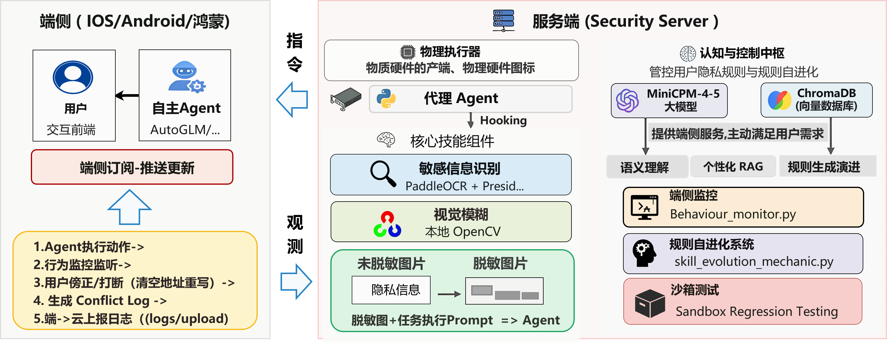
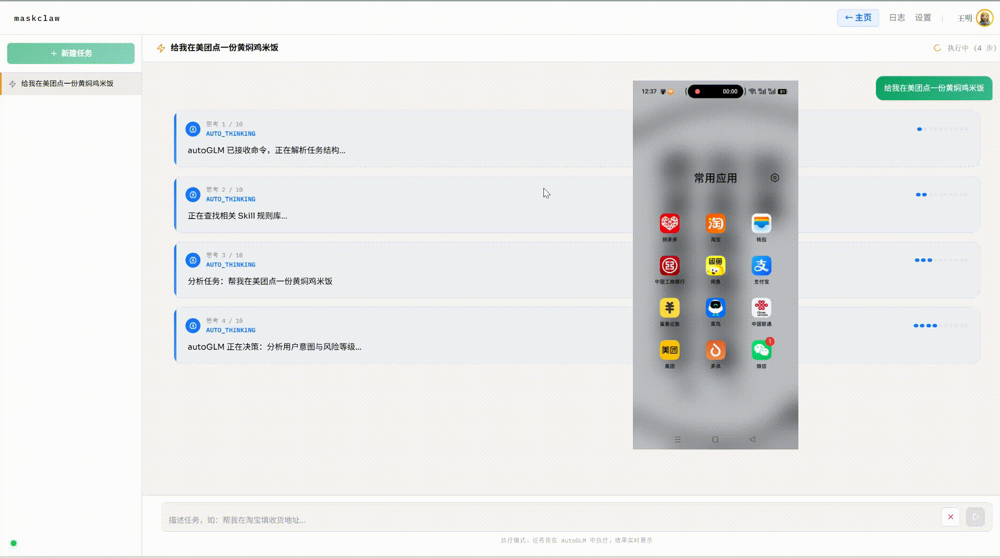
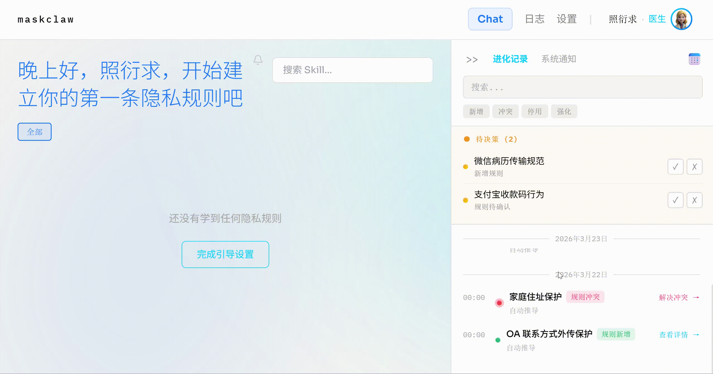

<p align="center">
  
</p>

<h1 align="center">MaskClaw</h1>

<p align="center">基于端侧模型自进化规则抽取的个性化隐私保护框架</p>

<p align="center">
  <a href="https://www.python.org/">
    
  </a>
  <a href="#">
    
  </a>
  <a href="https://fastapi.tiangolo.com/">
    
  </a>
  <a href="#">
    
  </a>
  <a href="#">
    
  </a>
  <a href="#">
    
  </a>
</p>

<p align="center">
  <strong>端侧隐私守卫</strong> | <strong>自进化规则引擎</strong> | <strong>人机协作确认</strong>
</p>

---

OpenClaw 等端侧 Agent 框架让手机自动完成填表、发消息、传文件成为现实。
**MaskClaw** 是专为这类 Agent 设计的隐私守卫层——在 Agent 执行操作前介入，判断这个动作该不该做、该怎么做，且所有推理全部在设备本地完成，**数据不出端**。

---

## 目录

- [项目概述](#项目概述)
- [核心痛点](#核心痛点)
- [系统架构](#系统架构)
- [三大核心模块](#三大核心模块)
- [设计亮点](#设计亮点)
- [前端展示](#前端展示)
- [实效数据](#实效数据)
- [同类对比](#同类对比)
- [赋能场景](#赋能场景)
- [项目结构](#项目结构)
- [快速开始](#快速开始)
- [API 接口](#api-接口)
- [文档索引](#文档索引)

---

## 项目概述

**MaskClaw** 是一个面向**端侧 Agent 隐私保护**的**自进化规则抽取框架**。它并非传统的数据加密或内容过滤工具，而是在 Agent 执行操作前进行**过程内调节**：识别敏感信息、判断操作风险、智能脱敏，并随用户行为反馈持续优化防护策略。



在 MaskClaw 中，**三类核心模块分工协作**，模拟现实中的隐私守护者角色，协同完成**视觉脱敏、行为监控、规则进化**等任务。框架内置**检索增强的认知机制（规则知识库 + 行为记忆）**，并通过**基于反馈的进化式学习**，使系统能够随使用积累自适应优化干预策略。

### 核心价值

| 价值维度 | 描述 |
|:---|:---|
| 🔒 **隐私安全保障** | 敏感数据在端侧处理，不上传云端，满足医疗、金融等行业合规要求 |
| 🧬 **个性化自适应** | 规则从用户真实行为中持续抽取，贴合个人隐私偏好 |
| 🤝 **人机协作确认** | 明确的置信度分级，Unsure 机制确保冷启动可用 |
| 🔄 **自进化能力** | 用户行为驱动规则更新，系统越用越懂用户 |

---

## 核心痛点

端侧 Agent 的自动化能力越强，隐私暴露面就越大。现有保护方案在三个层面上跟不上这个趋势：

### 🔍 感知层：只认格式，不认意图

身份证号、银行卡号这类格式化数据，现有工具尚可拦截。但 Agent 真正危险的操作往往没有固定格式——把截图发给陌生人、在不该填的地方填了真实住址、把内部文件传到外部平台。

> **这类行为靠正则匹配永远发现不了。**

### 👤 适配层：只有公共规则，没有个人规则

每个人对隐私的边界不一样，同一个字段在不同职业、不同场景下的敏感程度完全不同。现有方案提供的是一套对所有人都适用的最低标准，而不是随用户习惯动态调整的个性化防护。

> **规则僵化，无法因人而异。**

### ☁️ 架构层：云端审核本身就是泄露

将屏幕内容上传云端做语义判断，在很多行业的合规要求下根本不被允许，在个人用户侧也制造了"为保护隐私先出让隐私"的悖论。

> **数据上传云端，合规场景无法落地。**

---

## 系统架构

### 瘦客户端 + 胖服务端 + Skill-Use 规则调度的微服务解耦架构

MaskClaw 在不改动 AutoGLM、OpenClaw 等第三方 Agent 任何代码的前提下，通过 **Hooking 机制**介入 Agent 的执行链路。


<details>
<summary>📊 架构详解</summary>

| 层级 | 名称 | 核心组件 |
|:---:|:---|:---|
| **Layer 1** | 感知层 (Perception) | RapidOCR 格式敏感识别、OpenCV 本地视觉模糊处理 |
| **Layer 2** | 认知层 (Cognition) | MiniCPM-V 4.5 语义推理、ChromaDB RAG 规则检索 |
| **Layer 3** | 执行层 (Tool-Use) | Smart Masker 视觉打码、PII Detection 隐私检测 |
| **Layer 4** | 进化层 (Self-Evolution) | Behavior Monitor 行为监控、Skill Evolution 规则抽取、Sandbox 沙盒验证 |

</details>

### 工作流程

```
📸 端侧截图 → 🔍 PII 检测 → 🧠 RAG 检索 → ⚖️ 风险判决 → 🎭 视觉脱敏 → ✅ 安全转发
```

### 对第三方 Agent 完全透明

```
┌─────────────────────────────────────────────────────────────────────────┐
│                    传统架构：数据泄露风险                                 │
│                                                                         │
│    Agent ──→ 原始截图 ──→ 上传云端 ──→ 隐私泄露！                        │
│                                                                         │
└─────────────────────────────────────────────────────────────────────────┘

┌─────────────────────────────────────────────────────────────────────────┐
│                    MaskClaw 架构：安全闭环                               │
│                                                                         │
│    Agent ──→ 原始截图 ──→ MaskClaw ──→ 端侧脱敏 ──→ 安全数据 ──→ Agent   │
│                       ↗️                                                 │
│                  Hooking 介入                                             │
│                 无需修改 Agent 代码                                       │
│                                                                         │
└─────────────────────────────────────────────────────────────────────────┘
```

---

## 三大核心模块

### 🎭 Smart Masker

**智能视觉打码模块**，基于 RapidOCR 识别图片中的敏感文本区域并进行本地脱敏处理。

- 支持高斯模糊、马赛克、色块覆盖等多种打码方式
- RapidOCR 高性能毫秒级文本识别
- 数据全程不出端

### 📊 Behavior Monitor

**行为监控模块**，持续监听 Agent 操作行为，捕获用户主动干预动作。

- 记录修改填写值、拒绝操作等修正行为
- 为规则进化提供数据基础
- 支持会话轨迹追踪

### 🧬 Skill Evolution

**规则自进化模块**，基于爬山法从纠错日志中持续优化 SOP。

- 从用户真实行为中抽取新规则
- 经沙盒测试验证后自动挂载上线
- 系统越用越懂用户的个人隐私边界

---

## 设计亮点

### 🔒 轻量端侧模型 — 数据不出端的硬核保障

语义推理由 **MiniCPM-V 4.5** 承担，9B 参数量在消费级设备上可本地部署。敏感信息识别与视觉模糊处理全部在本地完成，不依赖网络连接。

| 组件 | 技术选型 | 优势 |
|:---|:---|:---|
| 视觉模型 | MiniCPM-V 4.5 (9B) | 端侧可部署，语义理解强 |
| OCR 引擎 | RapidOCR | 高性能毫秒级文本识别 |
| 脱敏处理 | OpenCV | 本地视觉处理，零上传 |
| 规则检索 | ChromaDB | 高效向量相似度检索 |

### 🧬 自进化经验库 — 规则从用户行为中生长

规则不是人工维护的静态列表，而是从用户真实操作行为中持续抽取、沙盒验证后自动挂载。

```
用户行为 → 行为日志 → 模式识别 → 规则抽取 → 沙盒测试 → 版本发布
                                                        ↓
                                                  人工审核门禁
```

### 🤝 人机协作确认 — 五级置信度智能判决

系统对自己的判断有明确的置信度分级，不同状态下采取不同策略：

| 判决 | 条件 | 系统行为 |
|:---:|:---|:---|
| **Allow** | 规则库完整匹配，安全 | 直接放行 |
| **Block** | 规则库完整匹配，风险明确 | 直接拦截 |
| **Mask** | 规则库完整匹配，需脱敏 | 执行打码后放行 |
| **Ask** | 规则库信息不完整 | 主动向用户确认 |
| **Unsure** | 新场景无记录 | 标记并等待用户教授 |

> 💡 **这一机制使系统在冷启动阶段也能保持可用**，而不是频繁误报或漏报。

### 🔄 协同过滤 — 群体智慧加速个性化收敛

| 用户阶段 | 规则来源 | 效果 |
|:---|:---|:---|
| 冷启动 | 通用基础规则集 | 开箱即用 |
| 早期积累 | 相似用户群协同过滤 | 快速收敛 |
| 稳定期 | 个人行为自进化 | 精准个性化 |

### 📊 P-GUI-Evo 数据集 — 业界首个 Agent 隐私评测基准

| 维度 | 规格 |
|:---|:---|
| 样本规模 | 622 条 |
| 用户画像 | 3 类（医疗顾问、带货主播、普通职员） |
| 操作场景 | 6 类真实场景 |
| 泛化变体 | 截图劣化、话术改写、DOM结构扰动 |
| 判决标签 | Allow / Block / Mask / Ask / Unsure |

## 前端展示

MaskClaw 提供简洁直观的 Web 界面，实时展示隐私保护状态与操作记录。

#### 发送命令



#### 打码显示


#### 通知提醒



#### Skill 列表管理


---

## 实效数据

### 数据集架构

| 维度 | 当前情况（实验版） | 说明 |
|:---|:---:|:---|
| 样本规模 | 622 | 已剔除 discard 条目 |
| 用户画像 | 3 类 | 医疗顾问 UserA、带货主播 UserB、普通职员 UserC |
| 分桶 | D1/D2/D3 | 分别对应基础、泛化、噪声/新分布压力 |
| 分桶规模 | D1: 216, D2: 252, D3: 154 | 按最终分桶清单统计 |
| 判决标签 | Allow/Block/Mask/Ask/Unsure | 与策略执行行为对齐 |

### 预期性能指标

| 指标 | 评测分桶 | 预期目标 |
|:---|:---:|:---:|
| 规则抽取 F1 | D1 冷启动 | ≥ 0.85 |
| 规则抽取 F1 | D2 泛化 | ≥ 0.75 |
| 判决准确率 | D1 全量 | ≥ 90% |
| 泛化降级率 | D2 vs D1 | ≤ 10% |
| Unsure 召回率 | D3 新分布 | ≥ 80% |

> **为什么设两层评测？** 判决准确率高不代表系统真正学到了规则。规则抽取 F1 衡量的是模型有没有抽出语义正确的规则，判决一致性层衡量的是这条规则能不能泛化到新样本。两层都过才算真正学会。

---

## 同类对比

| 维度 | MaskClaw | Google DLP | Microsoft Presidio | 云端大模型审核 |
|:---|:---:|:---:|:---:|:---:|
| **语境感知** | ✅ 多条件组合判断 | ❌ 格式匹配 | ❌ 格式匹配 | ⚠️ 语义理解但需上云 |
| **个性化规则** | ✅ 自动抽取持续进化 | ❌ 静态规则库 | ❌ 静态规则库 | ❌ 无记忆 |
| **数据不出端** | ✅ **全端侧** | ❌ 需联网 | ✅ 本地可部署 | ❌ 必须上传截图 |
| **自进化能力** | ✅ **有，用户行为驱动** | ❌ 无 | ❌ 无 | ❌ 无 |
| **不确定性输出** | ✅ **Unsure 机制** | ❌ 无 | ❌ 无 | ❌ 无 |
| **Agent 集成** | ✅ **Hooking 零改造** | ⚠️ 独立服务需接入 | ⚠️ 独立服务需接入 | ⚠️ API调用需接入 |

### 核心差距

1. **现有方案没有一个能同时做到语境感知 + 数据不出端。** 云端大模型在语义理解上能力足够，但上传截图这一步在合规敏感场景下是硬限制；本地方案（Presidio、DLP本地版）可以不出端，但处理不了语义层面的判断。**MaskClaw 是目前唯一在端侧完成语义级判断的方案。**

2. **没有任何现有方案具备规则自进化能力。** 所有对比方案的规则库都需要人工维护，无法从用户行为中学习。这在 Agent 深度介入用户操作的场景下是根本性缺陷。

---

## 赋能场景

| 方向 | 场景描述 | 核心价值 |
|:---|:---|:---|
| 📱 手机厂商系统级 Agent | 小艺、小布等系统服务常驻 | 对所有第三方 Agent 统一兜底，无需逐一适配 |
| 💼 企业移动办公套件 | 钉钉、飞书插件层 | 防止内部敏感信息经由 Agent 流出企业边界 |
| 🏥 医疗、金融终端设备 | 行业合规敏感场景 | 数据不出端架构满足行业强制要求 |

---

## 项目结构

```
MaskClaw/
├── api_server.py                 # FastAPI HTTP 服务 (端口 8001)
│
├── model_server/
│   ├── minicpm_api.py            # MiniCPM-V 视觉模型 API (端口 8000)
│   └── requirements.txt          # 模型服务依赖
│
├── frontend/
│   └── ui-app/                   # React 前端应用
│
├── models/                       # 模型文件目录
│
├── skills/                       # Skills 模块
│   ├── smart_masker.py           # 🎭 视觉打码模块
│   ├── behavior_monitor.py       # 📊 行为监控模块
│   └── evolution_mechanic.py     # 🧬 自进化机制
│
├── memory/                       # 记忆存储
│   ├── chroma_manager.py         # ChromaDB 管理器
│   └── chroma_storage/           # ChromaDB 数据库文件
│
├── prompts/                      # Prompt 模板
│
├── docs/                        # 架构文档
│   ├── ARCHITECTURE.md          # 系统架构文档
│   ├── SKILLS_API.md           # Skills API 文档
│   ├── RAG_SCHEMA.md           # RAG 数据模式
│   └── PROMPT_TEMPLATES.md     # Prompt 模板文档
│
├── sandbox/                     # 沙盒测试目录
│
├── autoglm_server.py            # Windows 端 AutoGLM 服务
├── demo.py                      # API 测试演示脚本
├── requirements.txt             # Python 依赖列表
├── README.md                   # 本文件
└── AGENTS.md                   # Agent 行为约束文档
```

---

## 快速开始

### 1. 安装依赖

```bash
pip install chromadb rapidocr-onnxrunner onnxruntime pillow opencv-python \
            fastapi uvicorn requests transformers>=4.51.0 torch
```

### 2. 启动模型服务 (端口 8000)

```bash
cd model_server
python minicpm_api.py
```

### 3. 启动隐私代理服务 (端口 8001)

```bash
python api_server.py
```

### 4. 验证服务状态

```bash
curl http://127.0.0.1:8001/
```

### 5. SSH 端口映射

```bash
ssh -L 8001:127.0.0.1:8001 root@服务器 -N
```

---

## API 接口

### 健康检查

```bash
# 隐私代理服务
curl http://localhost:8001/

# MiniCPM 视觉模型
curl -X POST http://localhost:8000/chat -F "prompt=hello"
```

### 处理截图（返回脱敏图片）

```bash
curl -X POST http://localhost:8001/process \
  -F "image=@test.jpg" \
  -F "command=分析当前页面隐私" \
  -o output.jpg
```

### 规则管理

```bash
# 查看所有规则
curl http://localhost:8001/rules

# 添加新规则
curl -X POST http://localhost:8001/rules \
  -H "Content-Type: application/json" \
  -d '{"scenario": "账号注册页", "target_field": "手机号", "document": "禁止填写真实手机号"}'
```

---

## 文档索引

| 文档 | 内容说明 |
|:---|:---|
| [系统架构](docs/ARCHITECTURE.md) | 系统整体设计与端云协同架构 |
| [Skills API](docs/SKILLS_API.md) | 三大核心 Skills 的输入输出契约 |
| [RAG 数据模式](docs/RAG_SCHEMA.md) | ChromaDB 向量数据库的存储范式 |
| [Prompt 模板](docs/PROMPT_TEMPLATES.md) | 端侧 LLM 推理与代码生成的模板 |
| [Agent 行为约束](AGENTS.md) | LLM 调度 Skills 的核心原则 |

---

## 伦理声明

> ⚠️ **请在引用、部署或二次开发前阅读**
>
> - 本项目面向隐私保护、风险识别与产品安全治理，**不用于法律意义上的身份认证**
> - 基于对话内容的隐私判断本质上是概率推断，而非身份事实确认
> - 项目**不鼓励**将模型输出直接用于惩罚性、歧视性或不可申诉的自动化决策
> - 涉及高风险处置、模式切换、账号限制时，应**保留人工复核与申诉机制**
> - 数据处理遵循最小化原则，只在必要时进行脱敏处理

---

## 支持与联系

- 📂 **GitHub 仓库**: [https://github.com/Theodora-Y/MaskClaw](https://github.com/Theodora-Y/MaskClaw)
- 🐛 **问题反馈**: [Issues 页面](https://github.com/Theodora-Y/MaskClaw/issues)
- 💡 **功能建议**: [Discussions 页面](https://github.com/Theodora-Y/MaskClaw/discussions)

---

## 引用

```bibtex
@misc{maskclaw_2026,
  title        = {MaskClaw: On-device Privacy-Preserving Framework with Self-Evolving Rule Extraction for Agent Systems},
  author       = {MaskClaw Team},
  year         = {2026},
  howpublished = {https://github.com/Theodora-Y/MaskClaw}
}
```

---

*Made with ❤️ by MaskClaw Team • 2026*
