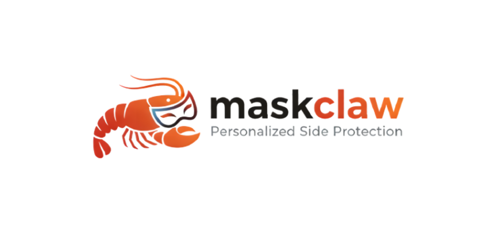

<div align="center">
  
</div>

<div align="center">

### 基于端侧模型自进化规则抽取的个性化隐私保护框架

[](https://www.python.org/)
[]()
[](https://fastapi.tiangolo.com/)
[]()
[]()

---

**端侧隐私守卫** × **自进化规则引擎** × **人机协作确认**

---

OpenClaw 等端侧 Agent 框架让手机自动完成填表、发消息、传文件成为现实。
**MaskClaw** 是专为这类 Agent 设计的隐私守卫层——在 Agent 执行操作前介入，判断这个动作该不该做、该怎么做，且所有推理全部在设备本地完成，**数据不出端**。

</div>

---

## 📑 目录

| 章节 | 内容 |
|:---:|:---|
| [📖 项目概述](#overview) | 项目定位与核心价值 |
| [🎯 核心痛点](#pain-points) | 感知层 / 适配层 / 架构层三大问题 |
| [🏗️ 系统架构](#architecture) | 三层拦截引擎 + 自进化闭环 |
| [🧩 四大核心模块](#modules) | PII Detection / Smart Masker / Behavior Monitor / Skill Evolution |
| [✨ 设计亮点](#features) | 轻量端侧模型 / 自进化经验库 / 人机协作确认 |
| [📊 实效数据](#data) | P-GUI-Evo 数据集与预期指标 |
| [⚔️ 同类对比](#comparison) | 与 DLP / Presidio / 云端审核详细对比 |
| [💡 赋能场景](#scenarios) | 手机厂商 / 企业办公 / 医疗金融 |
| [📂 项目结构](#structure) | 完整目录树 |
| [🚀 快速开始](#quickstart) | 8 步启动指南 |
| [🔌 API 接口](#api) | curl 示例 |
| [📚 文档索引](#docs) | 架构 / Skills / RAG / Prompt 文档 |
| [⚖️ 伦理声明](#ethics) | 使用规范 |

---

<a id="overview"></a>
## 📖 项目概述

**MaskClaw** 是一个面向**端侧 Agent 隐私保护**的**自进化规则抽取框架**。它并非传统的数据加密或内容过滤工具，而是在 Agent 执行操作前进行**过程内调节**：识别敏感信息、判断操作风险、智能脱敏，并随用户行为反馈持续优化防护策略。

<div align="center">
  
</div>

在 MaskClaw 中，**四类核心模块分工协作**，模拟现实中的隐私守护者角色，协同完成**隐私检测、视觉脱敏、行为监控、规则进化**等任务。框架内置**检索增强的认知机制（规则知识库 + 行为记忆）**，并通过**基于反馈的进化式学习**，使系统能够随使用积累自适应优化干预策略。

### 🎯 核心价值

| 价值维度 | 描述 |
|:---|:---|
| 🔒 **隐私安全保障** | 敏感数据在端侧处理，不上传云端，满足医疗、金融等行业合规要求 |
| 🧬 **个性化自适应** | 规则从用户真实行为中持续抽取，贴合个人隐私偏好 |
| 🤝 **人机协作确认** | 明确的置信度分级，Unsure 机制确保冷启动可用 |
| 🔄 **自进化能力** | 用户行为驱动规则更新，系统越用越懂用户 |

---

<a id="pain-points"></a>
## 🎯 我们试图解决的问题

端侧 Agent 的自动化能力越强，隐私暴露面就越大。现有保护方案在三个层面上跟不上这个趋势：

| 层级 | 问题 | 核心痛点 |
|:---:|:---|:---|
| **🔍 感知层** | 只认格式，不认意图 | 身份证号、银行卡号这类格式化数据，现有工具尚可拦截。但 Agent 真正危险的操作往往没有固定格式——把截图发给陌生人、在不该填的地方填了真实住址、把内部文件传到外部平台。**这类行为靠正则匹配永远发现不了。** |
| **👤 适配层** | 只有公共规则，没有个人规则 | 每个人对隐私的边界不一样，同一个字段在不同职业、不同场景下的敏感程度完全不同。现有方案提供的是一套对所有人都适用的最低标准，而不是随用户习惯动态调整的个性化防护。**规则僵化，无法因人而异。** |
| **☁️ 架构层** | 云端审核本身就是泄露 | 将屏幕内容上传云端做语义判断，在很多行业的合规要求下根本不被允许，在个人用户侧也制造了"为保护隐私先出让隐私"的悖论。**数据上传云端，合规场景无法落地。** |

---

<a id="architecture"></a>
## 🏗️ 系统架构

### 瘦客户端 + 胖服务端 + Skill-Use 规则调度的微服务解耦架构

MaskClaw 在不改动 AutoGLM、OpenClaw 等第三方 Agent 任何代码的前提下，通过 **Hooking 机制**介入 Agent 的执行链路。

```
┌─────────────────────────────────────────────────────────────────────────────┐
│                           MASKCLAW 隐私保护四层架构                          │
├─────────────────────────────────────────────────────────────────────────────┤
│                                                                             │
│   ┌─────────────────┐         ┌─────────────────┐         ┌───────────────┐ │
│   ║   LAYER 1       ║   →    ║   LAYER 2       ║   →    ║   LAYER 3     ║ │
│   ║   感知层        ║         ║   认知层        ║         ║   执行层      ║ │
│   ║   Perception    ║         ║   Cognition     ║         ║   Tool-Use   ║ │
│   ├─────────────────┤         ├─────────────────┤         ├───────────────┤ │
│   ║  📋 PaddleOCR   ║         ║  🧠 MiniCPM-4.5 ║         ║  🎭 Smart    ║ │
│   ║     毫秒级格式  ║         ║    语义推理     ║         ║    Masker    ║ │
│   ║     敏感识别    ║         ║                 ║         ║    视觉打码   ║ │
│   ║                 ║         ║  📚 ChromaDB    ║         ║               ║ │
│   ║  🎨 OpenCV      ║         ║    RAG 规则检索 ║         ║  👁️ PII     ║ │
│   ║     本地视觉    ║         ║                 ║         ║    Detection   ║ │
│   ║     模糊处理    ║         ║  🎯 场景匹配    ║         ║    隐私检测   ║ │
│   ║                 ║         ║  ⚡ Skill 调度  ║         ║               ║ │
│   └─────────────────┘         └─────────────────┘         └───────────────┘ │
│          │                          │                          │           │
│          └──────────────────────────┼──────────────────────────┘           │
│                                     ↓                                         │
│                           ┌───────────────────┐                              │
│                           ║   LAYER 4         ║                              │
│                           ║   进化层          ║                              │
│                           ║   Self-Evolution ║                              │
│                           ├───────────────────┤                              │
│                           ║  📊 Behaviour_   ║                              │
│                           ║     monitor      ║                              │
│                           ║     行为监控捕获  ║                              │
│                           ║                   ║                              │
│                           ║  🧬 Skill_       ║                              │
│                           ║     evolution    ║                              │
│                           ║     规则抽取生成 ║                              │
│                           ║                   ║                              │
│                           ║  🔬 Sandbox 测试  ║                              │
│                           ║     沙盒回归验证  ║                              │
│                           ║                   ║                              │
│                           └───────────────────┘                              │
└─────────────────────────────────────────────────────────────────────────────┘
```

### 🔄 工作流程

```
📸 端侧截图 → 🔍 PII 检测 → 🧠 RAG 检索 → ⚖️ 风险判决 → 🎭 视觉脱敏 → ✅ 安全转发
```

### 🛡️ 对第三方 Agent 完全透明

```
┌─────────────────────────────────────────────────────────────────────────┐
│                         传统架构：数据泄露风险                            │
│                                                                         │
│    Agent ──→ 原始截图 ──→ 上传云端 ──→ 🔴 隐私泄露！                       │
│                                                                         │
└─────────────────────────────────────────────────────────────────────────┘

┌─────────────────────────────────────────────────────────────────────────┐
│                         MaskClaw 架构：安全闭环                          │
│                                                                         │
│    Agent ──→ 原始截图 ──→ MaskClaw ──→ 端侧脱敏 ──→ 安全数据 ──→ Agent    │
│                       ↗️                                                  │
│                  Hooking 介入                                              │
│                 无需修改 Agent 代码                                        │
│                                                                         │
└─────────────────────────────────────────────────────────────────────────┘
```

---

<a id="modules"></a>
## 🧩 四大核心模块

| 模块 | 功能 | 核心能力 |
|:---|:---|:---|
| **🔍 PII Detection** | 隐私信息检测 | 支持手机号、身份证、银行卡、住址、姓名等毫秒级识别。采用 PaddleOCR + Presidio 双引擎保障精度 |
| **🎭 Smart Masker** | 智能视觉打码 | 支持马赛克、高斯模糊、区域色块覆盖等多种打码方式。OpenCV 驱动的本地处理，零上传 |
| **📊 Behavior Monitor** | 行为监控 | 持续监听 Agent 操作行为，捕获用户主动干预动作（修改填写值、拒绝操作等） |
| **🧬 Skill Evolution** | 规则自进化 | 从纠错日志中智能抽取新规则，经沙盒测试验证后自动挂载上线，无需人工维护 |

---

<a id="features"></a>
## ✨ 设计亮点

### 🔒 轻量端侧模型 — 数据不出端的硬核保障

语义推理由 **MiniCPM-4.5** 承担，9B 参数量在消费级设备上可本地部署。敏感信息识别与视觉模糊处理全部在本地完成，不依赖网络连接。

| 组件 | 技术选型 | 优势 |
|:---|:---|:---|
| 视觉模型 | MiniCPM-4.5 (9B) | 端侧可部署，语义理解强 |
| OCR 引擎 | PaddleOCR | 毫秒级格式化信息识别 |
| 脱敏处理 | OpenCV | 本地视觉处理，零上传 |
| 规则检索 | ChromaDB | 高效向量相似度检索 |

---

### 🧬 自进化经验库 — 规则从用户行为中生长

规则不是人工维护的静态列表，而是从用户真实操作行为中持续抽取、沙盒验证后自动挂载。系统上线时携带通用基础规则集，随使用时间积累逐步收敛到每个用户自己的隐私偏好，**无需用户手动配置任何规则**。

```
用户行为 → 行为日志 → 模式识别 → 规则抽取 → 沙盒测试 → 版本发布
                                                        ↓
                                                  人工审核门禁
```

---

### 🤝 人机协作确认 — 五级置信度智能判决

系统对自己的判断有明确的置信度分级，不同状态下采取不同策略：

| 判决 | 条件 | 系统行为 |
|:---:|:---|:---|
| **🟢 Allow** | 规则库完整匹配，安全 | 直接放行 |
| **🔴 Block** | 规则库完整匹配，风险明确 | 直接拦截 |
| **🟡 Mask** | 规则库完整匹配，需脱敏 | 执行打码后放行 |
| **🔵 Ask** | 规则库信息不完整 | 主动向用户确认 |
| **🟣 Unsure** | 新场景无记录 | 标记并等待用户教授 |

> 💡 **这一机制使系统在冷启动阶段也能保持可用**，而不是频繁误报或漏报。

---

### 🔄 协同过滤 — 群体智慧加速个性化收敛

通过对多用户规则的横向聚合，可以在新用户规则库尚未积累完善时，从相似用户群体的经验中提取参考规则，加速个性化收敛过程。

| 用户阶段 | 规则来源 | 效果 |
|:---|:---|:---|
| 冷启动 | 通用基础规则集 | 开箱即用 |
| 早期积累 | 相似用户群协同过滤 | 快速收敛 |
| 稳定期 | 个人行为自进化 | 精准个性化 |

---

### 📊 P-GUI-Evo 数据集 — 业界首个 Agent 隐私评测基准

学术界目前没有带用户个性化反馈的 Agent 隐私操作数据集。MaskClaw 配套构建了 **P-GUI-Evo** 数据集：

| 维度 | 规格 |
|:---|:---|
| 📦 样本规模 | 622 条 |
| 👤 用户画像 | 3 类（医疗顾问、带货主播、普通职员） |
| 🎬 操作场景 | 6 类真实场景 |
| 🔄 泛化变体 | 截图劣化、话术改写、DOM结构扰动 |
| 🏷️ 判决标签 | Allow / Block / Mask / Ask / Unsure |

---

<a id="data"></a>
## 📊 实效数据

### 数据集架构

| 维度 | 当前情况（实验版） | 说明 |
|:---|:---:|:---|
| 样本规模 | 622 | 已剔除 discard 条目 |
| 用户画像 | 3 类 | 医疗顾问 UserA、带货主播 UserB、普通职员 UserC |
| 分桶 | D1/D2/D3 | 分别对应基础、泛化、噪声/新分布压力 |
| 分桶规模 | D1: 216, D2: 252, D3: 154 | 按最终分桶清单统计 |
| 判决标签 | Allow/Block/Mask/Ask/Unsure | 与策略执行行为对齐 |

### 预期性能指标

| 指标 | 评测分桶 | 预期目标 |
|:---|:---:|:---:|
| 规则抽取 F1 | D1 冷启动 | ≥ 0.85 |
| 规则抽取 F1 | D2 泛化 | ≥ 0.75 |
| 判决准确率 | D1 全量 | ≥ 90% |
| 泛化降级率 | D2 vs D1 | ≤ 10% |
| Unsure 召回率 | D3 新分布 | ≥ 80% |
| PII 定位与打码准确率 | D1 全量 | ≥ 90% |

> **📌 为什么设两层评测？** 判决准确率高不代表系统真正学到了规则。规则抽取 F1 衡量的是模型有没有抽出语义正确的规则，判决一致性层衡量的是这条规则能不能泛化到新样本。两层都过才算真正学会。

---

<a id="comparison"></a>
## ⚔️ 同类方案对比

| 维度 | MaskClaw | Google DLP | Microsoft Presidio | 云端大模型审核 | Agent 框架内置 |
|:---|:---:|:---:|:---:|:---:|:---:|
| **语境感知** | ✅ 多条件组合判断 | ❌ 格式匹配 | ❌ 格式匹配 | ⚠️ 语义理解但需上云 | ❌ 无 |
| **个性化规则** | ✅ 自动抽取持续进化 | ❌ 静态规则库 | ❌ 静态规则库 | ❌ 无记忆 | ❌ 无 |
| **数据不出端** | ✅ **全端侧** | ❌ 需联网 | ✅ 本地可部署 | ❌ 必须上传截图 | ✅ 本地 |
| **自进化能力** | ✅ **有，用户行为驱动** | ❌ 无 | ❌ 无 | ❌ 无 | ❌ 无 |
| **不确定性输出** | ✅ **Unsure 机制** | ❌ 无 | ❌ 无 | ❌ 无 | ❌ 无 |
| **Agent 集成** | ✅ **Hooking 零改造** | ⚠️ 独立服务需接入 | ⚠️ 独立服务需接入 | ⚠️ API调用需接入 | ❌ 框架绑定 |

### 核心差距

1. **现有方案没有一个能同时做到语境感知 + 数据不出端。** 云端大模型在语义理解上能力足够，但上传截图这一步在合规敏感场景下是硬限制；本地方案（Presidio、DLP本地版）可以不出端，但处理不了语义层面的判断。**MaskClaw 是目前唯一在端侧完成语义级判断的方案。**

2. **没有任何现有方案具备规则自进化能力。** 所有对比方案的规则库都需要人工维护，无法从用户行为中学习。这在 Agent 深度介入用户操作的场景下是根本性缺陷。

---

<a id="scenarios"></a>
## 💡 产学研赋能

MaskClaw 的架构天然适合作为独立中间件嵌入现有产品线，不要求上游改造。

### 可嵌入的产品方向

| 方向 | 场景描述 | 核心价值 |
|:---|:---|:---|
| 📱 手机厂商系统级 Agent | 小艺、小布等系统服务常驻 | 对所有第三方 Agent 统一兜底，无需逐一适配 |
| 💼 企业移动办公套件 | 钉钉、飞书插件层 | 防止内部敏感信息经由 Agent 流出企业边界 |
| 🏥 医疗、金融终端设备 | 行业合规敏感场景 | 数据不出端架构满足行业强制要求，可作为 DLP 语义增强层 |

### 数据资产的独立价值

**P-GUI-Evo 数据集**覆盖六类真实操作场景、三类用户画像、三种泛化变体构建方式，是目前唯一面向 Agent 隐私操作评测的合成数据集，可独立授权给隐私合规产品作为评测基准使用。

---

<a id="structure"></a>
## 📂 项目结构

```
MaskClaw/
├── api_server.py                 # FastAPI HTTP 服务 (端口 8001)
│
├── model_server/
│   ├── minicpm_api.py            # MiniCPM-V 视觉模型 API (端口 8000)
│   └── requirements.txt          # 模型服务依赖
│
├── frontend/
│   └── ui-app/                   # React 前端应用
│
├── models/                       # 模型文件目录
│   └── OpenBMB/
│       └── MiniCPM-V-4_5/       # 视觉理解模型 (~16.5GB)
│
├── skills/                       # Skills 模块
│   ├── smart_masker.py           # 视觉打码模块
│   ├── behavior_monitor.py       # 行为监控模块
│   └── evolution_mechanic.py     # 自进化机制
│
├── memory/                       # 记忆存储
│   ├── chroma_manager.py         # ChromaDB 管理器
│   └── chroma_storage/           # ChromaDB 数据库文件
│
├── prompts/                     # Prompt 模板
│
├── docs/                        # 架构文档
│   ├── ARCHITECTURE.md         # 系统架构文档
│   ├── SKILLS_API.md           # Skills API 文档
│   ├── RAG_SCHEMA.md           # RAG 数据模式
│   └── PROMPT_TEMPLATES.md     # Prompt 模板文档
│
├── sandbox/                     # 沙盒测试目录
│
├── autoglm_server.py           # Windows 端 AutoGLM 服务
├── demo.py                     # API 测试演示脚本
├── requirements.txt            # Python 依赖列表
├── README.md                   # 本文件
└── AGENTS.md                   # Agent 行为约束文档
```

---

<a id="quickstart"></a>
## 🚀 快速开始

### 1️⃣ 安装依赖

```bash
# Python 依赖
pip install chromadb rapidocr-onnxrunner onnxruntime pillow opencv-python \
            fastapi uvicorn requests transformers>=4.51.0 torch

# 前端依赖
cd frontend/ui-app && npm install
```

### 2️⃣ 启动模型服务 (端口 8000)

```bash
cd model_server && python minicpm_api.py
```

### 3️⃣ 启动隐私代理服务 (端口 8001)

```bash
python api_server.py
```

### 4️⃣ 验证服务状态

```bash
curl http://127.0.0.1:8001/
```

### 5️⃣ 重启服务（如需）

```bash
kill <PID>  # 杀掉旧进程
python api_server.py
```

### 6️⃣ 启动前端应用

```bash
cd frontend/ui-app && npm run dev
```

### 7️⃣ Windows 本地开发

```bash
# 激活 conda 环境
conda activate autoglm

# 启动 AutoGLM 服务
python autoglm_server.py

# 关闭 SSH 连接
taskkill /f /im ssh.exe
```

### 8️⃣ SSH 端口映射

**方式一：单端口映射**
```bash
ssh -L 8001:127.0.0.1:8001 root@connect.bjb1.seetacloud.com -N
```

**方式二：双端口完整映射**
```bash
# 映射 8001 端口
ssh -L 9001:127.0.0.1:8001 root@connect.bjb1.seetacloud.com -p 36647 -N

# 映射 28080 端口
ssh -R 28080:127.0.0.1:28080 root@connect.bjb1.seetacloud.com -p 36647 -N
```

---

<a id="api"></a>
## 🔌 API 接口

### 健康检查

```bash
# 隐私代理服务
curl http://localhost:8001/

# MiniCPM 视觉模型
curl -X POST http://localhost:8000/chat -F "prompt=hello"
```

### 处理截图（返回脱敏图片）

```bash
curl -X POST http://localhost:8001/process \
  -F "image=@test.jpg" \
  -F "command=分析当前页面隐私" \
  -o output.jpg
```

### 规则管理

```bash
# 查看所有规则
curl http://localhost:8001/rules

# 添加新规则
curl -X POST http://localhost:8001/rules \
  -H "Content-Type: application/json" \
  -d '{
    "scenario": "账号注册页",
    "target_field": "手机号",
    "document": "禁止填写真实手机号",
    "skill": "Visual_Obfuscation_Skill"
  }'
```

---

<a id="docs"></a>
## 📚 文档索引

| 文档 | 内容说明 |
|:---|:---|
| [AGENTS.md](AGENTS.md) | Agent 身份定位、Tool-Use 调度模式、端侧闭环原则、防御链路幂等性 |
| [ARCHITECTURE.md](docs/ARCHITECTURE.md) | 系统整体架构、四层协同设计、端云交互协议 |
| [SKILLS_API.md](docs/SKILLS_API.md) | PII_Detection / Smart_Masker / Behavior_Monitor / Skill_Evolution 接口契约 |
| [RAG_SCHEMA.md](docs/RAG_SCHEMA.md) | ChromaDB 存储范式、元数据设计、检索优化策略 |
| [PROMPT_TEMPLATES.md](docs/PROMPT_TEMPLATES.md) | 端侧 LLM 推理、Critique、代码补丁生成的 Prompt 模板 |

---

<a id="ethics"></a>
## ⚖️ 伦理声明

> **⚠️ 请在引用、部署或二次开发前阅读**
>
> - 本项目面向隐私保护、风险识别与产品安全治理，**不用于法律意义上的身份认证**
> - 基于对话内容的隐私判断本质上是概率推断，而非身份事实确认
> - 项目**不鼓励**将模型输出直接用于惩罚性、歧视性或不可申诉的自动化决策
> - 涉及高风险处置、模式切换、账号限制时，应**保留人工复核与申诉机制**
> - 数据处理遵循最小化原则，只在必要时进行脱敏处理

---

## 🤝 支持与联系

- 📂 **GitHub 仓库**: [https://github.com/Theodora-Y/MaskClaw](https://github.com/Theodora-Y/MaskClaw)
- 🐛 **问题反馈**: [Issues 页面](https://github.com/Theodora-Y/MaskClaw/issues)
- 💡 **功能建议**: [Discussions 页面](https://github.com/Theodora-Y/MaskClaw/discussions)

---

## 📄 引用

如果您在研究中使用了本项目，请引用：

```bibtex
@misc{maskclaw_2026,
  title        = {MaskClaw: On-device Privacy-Preserving Framework with Self-Evolving Rule Extraction for Agent Systems},
  author       = {MaskClaw Team},
  year         = {2026},
  howpublished = {https://github.com/Theodora-Y/MaskClaw},
  note         = {GitHub repository}
}
```

---

<div align="center">
  <p>Made with ❤️ by MaskClaw Team • 2026</p>
</div>
